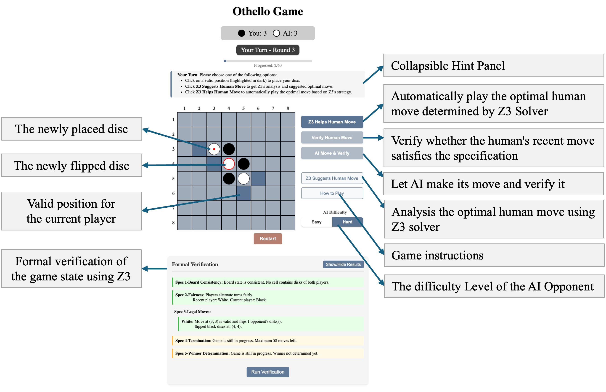

# Formal Verification of Othello Game Using Z3 and nuXmv/SMV

This project implements the board game Othello with integrated formal verification using two complementary tools: Z3 and nuXmv/SMV. It demonstrates how formal methods can be used not only to verify rule compliance but also to enhance strategic decision-making in an interactive, web-based environment.

## Project Overview

We build and verify Othello on both 8X8 and 4X4 boards. Z3 is embedded into a Python-Flask web backend to support real-time specification verification and symbolic move recommendation. nuXmv is used to verify reachability and correctness properties offline using temporal logic, focusing on the 4X4 board to manage state complexity.

###  Z3 Features

- **Runtime Specification Verification**: Enforces five core rules of Othello including board consistency, turn fairness, move legality, termination, and winner correctness.
- **Strategic Move Recommendation**: Suggests optimal moves using a tiered solver architecture that combines symbolic reasoning and heuristic fallback models.
- **Interactive Web Interface**: Users can verify moves, receive strategy suggestions, and play against AI of different difficulty levels.

  

### nuXmv/SMV Features

- **Offline Temporal Verification**: Uses LTL specifications to validate properties such as legal termination and correct winner detection.
- **Reachability Analysis**: Ensures specific board states are reachable from initial configurations.
- **BMC and Simulation Support**: Provides bounded model checking and symbolic simulation for exhaustive validation.

## Repository Structure

```
├── Othello/                       # Flask implementation of web-based Othello
├── Z3_Othello/                    # Z3-based specification verifier with web interface
├── Z3_Othello_solver_4*4/         # 4x4 board version with Z3 verifier and Z3 solver
├── Z3_Othello_solver_8*8/         # 8x8 board version with Z3 verifier and Z3 solver
├── Z3_Othello_solver_8*8_updated/ # Enhanced 8x8 Othello with Z3 verifier and multi-step lookahead Z3 solver
├── smv/                           # nuXmv model checking scripts and SMV files
├── README/                        # Images and resources used in README.md
└── README.md                      # This file
```

## Getting Started

### Z3 Version (Web Interface)

#### Prerequisites

- Python 3.8+
- A modern web browser (Chrome, Firefox, Safari, or Edge)
- Internet connection (for dependency download)

#### Installation

```bash
git clone https://github.com/29xuan/Othello.git
cd Z3_Othello_solver_8*8
pip install -r requirements.txt
```

#### Running the Code

```bash
python main.py
```

Navigate to `http://localhost:5000` in your browser. For more usage instructions, please refer to the `README.md` file in each Z3 folder.

### nuXmv/SMV Version

#### Prerequisites

- nuXmv installed (https://nuxmv.fbk.eu/)

#### Example Commands

```bash
nuXmv -int othello_16_onedir_disableflip.smv
go
build_boolean_model
bmc_setup
check_ltlspec_bmc -k 5 -n 1
```

Refer to `smv/README.md` file for more usage instructions.

## Acknowledgements

We acknowledge the following tools and resources:

- Z3 SMT Solver (Microsoft Research): for runtime constraint solving and strategic reasoning.
- nuXmv Model Checker (FBK): for temporal logic verification on the 4×4 board.
- ChatGPT: for assistance with SMV modeling, Z3 debugging, and Flask integration.

