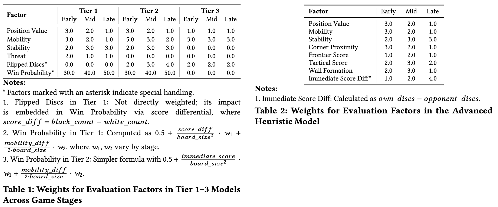

# Z3-based Othello Solver with Strategic Analysis in the 8X8 Board

## Overview

`Z3_Othello_solver_8*8` is an enhanced version of the Othello game that integrates the Z3 to not only verify specifications but also to provide strategic move recommendations. This application features an 8X8 game board where players can compete against an AI with adjustable difficulty levels while receiving detailed analysis and hints for optimal moves based on formal verification techniques.

## Features

- Web-based interface built with Flask
- Formal verification of game rules using Z3 
- Advanced move recommendation system powered by Z3 constraint solving
- Multiple AI difficulty levels (easy/hard)
- Detailed strategic analysis of board positions

## Repository Structure

```
Z3_Othello_solver_8*8/
├── main.py              # Application entry point
├── flask_app.py         # Flask web application routes and API endpoints
├── game_logic.py        # Core Othello game mechanics and state management
├── verification.py      # Z3-based formal verification implementation
├── z3_solver.py         # Advanced Z3 solver for move recommendations
├── ai.py                # AI opponent implementation with difficulty levels
├── requirements.txt     # Project dependencies
├── static/              # Frontend assets
│   ├── othello.js       # Game frontend logic and solver integration
│   └── othello.css      # Game styling and responsive design
├── templates/           # HTML templates
│   └── index.html       # Main game interface
└── README.md            # This file
```

## Getting Started

### Prerequisites

- Python 3.6+
- Flask
- Z3 Solver
- NumPy
- Requests

### Running the Code

1. Install required Python dependencies:

```bash
pip install -r requirements.txt
```

2. Clone or download the project code:

```bash
git clone https://github.com/29xuan/Othello.git
cd Z3_Othello_solver_8*8
```

3. Run the game:

```bash
python main.py
```

4. Access the game in your browser at: `http://localhost:5000`

## Formal Verification

This project leverages the Z3 to implement formal verification of Othello game rules through five key specifications:

- **Board Consistency**: Each cell contains exactly one state (empty, black, or white).
- **Fairness**: Both players alternate turns and have equal opportunities to place.
- **Legal Move**: Ensures each move follows Othello rules by validating empty cell placement and opponent piece flipping.
- **Termination**: Game ends when no valid moves or board is full.
- **Winner Determination**: The player with more discs wins.

## Strategic Move Recommendation

### Tiered Z3 Architecture

- **Tier 1**: Complete Z3 model that symbolically encodes all five strategic factors with a 45-second timeout.
- **Tier 2**: Simplified Z3 model focusing on candidate moves rather than the full board with a 25-second timeout.
- **Tier 3**: Minimal Z3 model retaining only position value, flipped discs count, and mobility with an 8-second timeout.
- **Fallback**: Advanced heuristic evaluation using handcrafted strategy features when all symbolic tiers fail.

### Five Strategy Factors

- **Position Value**: Strategic importance of board positions, with highest weights to corners and penalties for X-squares.
- **Mobility**: Difference in valid moves available to both players, where higher mobility indicates better future flexibility.
- **Stability and Threat**: Assessment of discs that cannot be flipped and risks of enabling advantageous opponent responses.
- **Disc Count**: Evaluation of opponent discs flipped by a move, with importance that varies by game stage.
- **Win Probability**: Estimation of winning likelihood based on multiple game state indicators.

### Weights for Evaluation Factors

The following table shows the weights used for each evaluation factor across different tiers and game stages:



## Enhancements Over Base `Z3_Othello`

Compared to the base `Z3_Othello` implementation, this version adds:

- **Strategic Move Recommendations**: Advanced Z3-based analysis to recommend optimal moves
- **Detailed Move Explanations**: In-depth explanations of why certain moves are recommended
- **Variable AI Difficulty**: Adjustable AI opponent difficulty levels
- **Enhanced UI**: More detailed visualization of game state and analysis

## Acknowledgements

- [Z3 Theorem Prover](https://github.com/Z3Prover/z3) - Microsoft Research's constraint solver
- [Flask Web Framework](https://flask.palletsprojects.com/) - Lightweight Python web framework
- [Othello/Reversi](https://en.wikipedia.org/wiki/Reversi) - Classic board game concept and rules
- [ChatGPT](https://chat.openai.com) - Assisted with syntax understanding and debugging